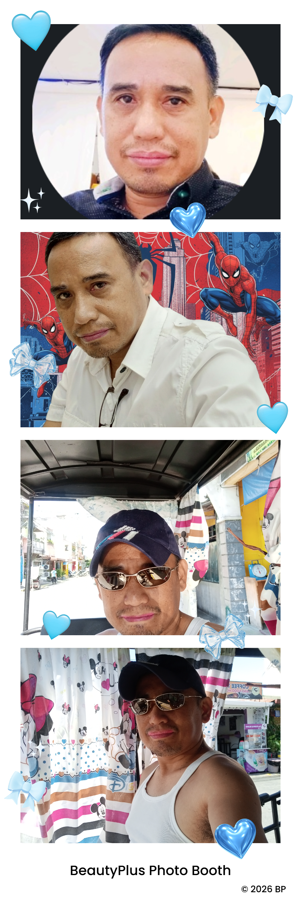

# leomar5losarito.github.io
### This is a test only
 

## Imagination, life is your creation

Right now, open communities are building amazing software together, and there are excellent "good first issue" opportunities, if you're looking to get involved.

<!--* [Explore featured projects](https://opensource.microsoft.com/projects/)
* [Explore open source jobs at](https://careers.microsoft.com/us/en/search-results?keywords=open%20source)
* [Apply credits for open source projects](https://opensource.microsoft.com/azure-credits)
* Use [repository issues](https://docs.github.com/en/issues/tracking-your-work-with-issues/creating-an-issue)
and not [opensource@microsoft.com](mailto:opensource@microsoft.com) to ask questions specific to an individual repository.

Visit [opensource.microsoft.com](https://opensource.microsoft.com) to learn more!

----

This projects adopt the [Open Source Code of Conduct](https://opensource.microsoft.com/codeofconduct/). For more information see the [Code of Conduct FAQ](https://opensource.microsoft.com/codeofconduct/faq/).
-->
