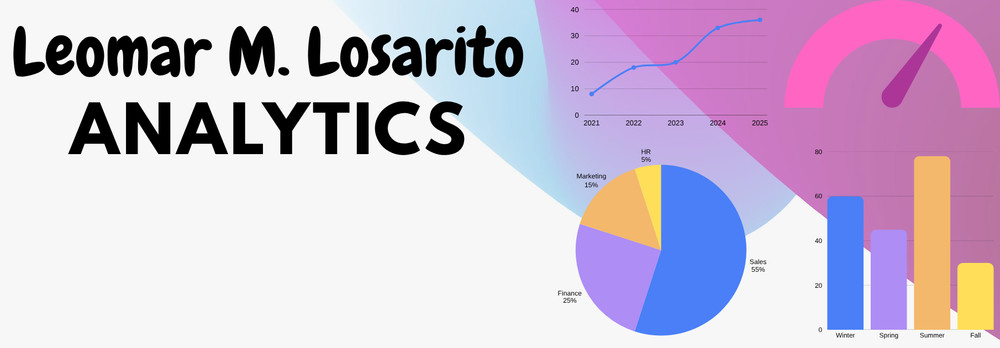

# leomar5losarito.github.io
### This is a test only
 

## Imagination, life is your creation

Right now, open communities are building amazing software together, and there are excellent "good first issue" opportunities, if you're looking to get involved.

# 📊 Superstore Dataset Dashboard - Tableau Visualization  

This repository contains an **interactive Tableau dashboard** built using the **Superstore dataset**. It provides actionable insights and visual analytics to help users analyze store performance across various dimensions, including **sales, profit, customer behavior, and product categories**.  

## ✨ Features  
✅ **Sales & Profit Analysis** – Track total sales, profit margins, and regional performance.  
✅ **Interactive Visualizations** – Dynamic filters, drill-down capabilities, and insightful charts.  
✅ **Customer Insights** – Identify buying trends, customer segmentation, and retention patterns.  
✅ **Product Performance** – Analyze top-selling and least-performing products.  
✅ **User-Friendly Design** – Clean, structured dashboard for seamless data exploration.  

### 📌 Dashboard Previews  
📈 **Overall Dashboard:** [View Here](https://github.com/Harshavladimir/Superstore_Dataset_Dashboard-Using-Tableau/blob/main/Overall%20Dashboard.png)  
🌍 **Detailed Dashboard:** [View Here](https://github.com/Harshavladimir/Superstore_Dataset_Dashboard-Using-Tableau/blob/main/Table%20data.png)  

## 🔹 Use Cases  
- **Performance tracking** for sales and profitability.  
- **Data-driven decision-making** to optimize marketing strategies.  
- **Customer segmentation** for better business insights.  

## 🛠️ Requirements  
You need **Tableau Desktop** or **Tableau Public** to open and interact with the dashboard.  

## 🚀 How to Use  
1. **Download** the Tableau workbook (`.twb` or `.twbx` file) from this repository.  
2. **Open** it in Tableau Desktop or Tableau Public.  
3. **Explore** the interactive controls to analyze sales trends, profits, and customer behaviors.  

💡 Feel free to **fork, contribute, or raise issues** for improvements! 🚀  

<!--* [Explore featured projects](https://opensource.microsoft.com/projects/)
* [Explore open source jobs at](https://careers.microsoft.com/us/en/search-results?keywords=open%20source)
* [Apply credits for open source projects](https://opensource.microsoft.com/azure-credits)
* Use [repository issues](https://docs.github.com/en/issues/tracking-your-work-with-issues/creating-an-issue)
and not [opensource@microsoft.com](mailto:opensource@microsoft.com) to ask questions specific to an individual repository.

Visit [opensource.microsoft.com](https://opensource.microsoft.com) to learn more!

----

This projects adopt the [Open Source Code of Conduct](https://opensource.microsoft.com/codeofconduct/). For more information see the [Code of Conduct FAQ](https://opensource.microsoft.com/codeofconduct/faq/).
-->
